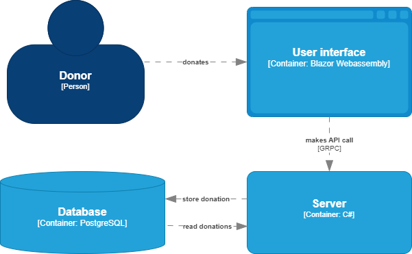

# Motivation
This is a sample exercise for a coding dojo in C#.

The application consists of a user interface part and a server part with a database. Everything is in one application to avoid unnecessary complexity. API calls are reduced to method calls.

Read my articles to find out how my [younger](https://medium.com/@kinneko-de/344fe6e8e4f6) and [older](https://medium.com/@kinneko-de/0de8a4351da2) selves solved this coding dojo.

# Challenge
Develop the application further. You are completely free in your decisions

## Architecture in a real world example
In a real world the UI would run on the client. The UI would access the server over an API.

## Sources
**The headliner image was generated using Gemini's image generation capabilities.**

Gemini is a large language model developed by Google AI. It can generate realistic and diverse images based on text prompts. [Learn more about Gemini](https://www.gemini.google.com).
